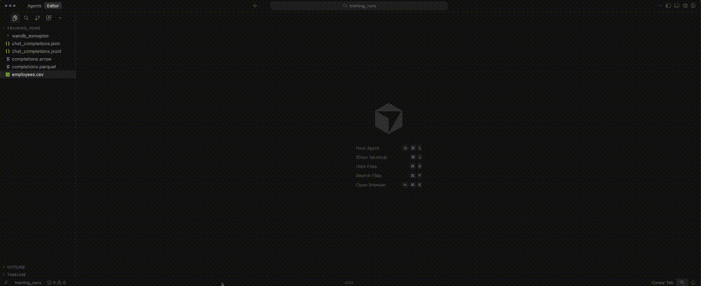
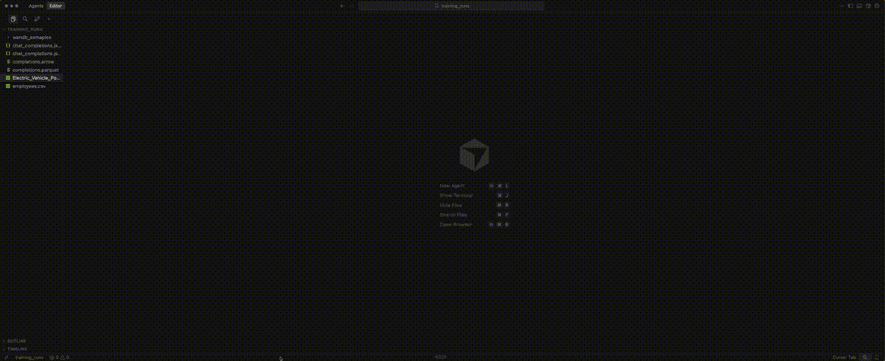
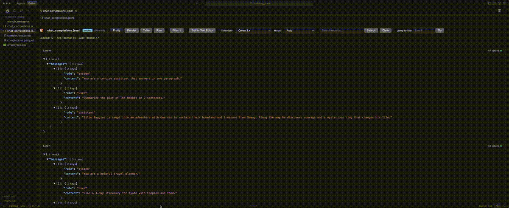

# Bread Dataset Viewer

**Open Source Dataset Viewer for ML Engineers** | Stop fighting with crashed editors and unreadable data


> **Viewing rollouts and training data shouldn't be this hard.** Built because existing tools crash, freeze, or force you to load entire datasets into memory. Open 100GB+ JSONL, Parquet, and CSV files instantly with a clean, understandable interface that actually works.

[Install from Marketplace](https://marketplace.visualstudio.com/items?itemName=bread-tech.bread-dataset-viewer) | [View on GitHub](https://github.com/Bread-Technologies/mle_vscode_extension) | [Report Issue](https://github.com/Bread-Technologies/mle_vscode_extension/issues)



## Why Developers Choose Bread Dataset Viewer

<table>
<tr>
<td width="33%" align="center">
<h3>⚡ Actually Works</h3>
Open 100GB+ files in under 1 second. No crashes, no freezing, no "out of memory" errors. Built because viewing rollouts shouldn't crash your editor.
</td>
<td width="33%" align="center">
<h3>👁️ Readable Interface</h3>
Clean Cards, Table, and Raw views. Collapsible JSON, searchable data, jump-to-line navigation. Finally understand your data without squinting.
</td>
<td width="33%" align="center">
<h3>🎯 Real Token Counts</h3>
16 production tokenizers from GPT, Claude, Llama, Qwen. Not estimates—actual counts for ML training and rollout validation.
</td>
</tr>
</table>

## What It Does

**Viewing rollouts is annoying. Viewing data in general is annoying.** You shouldn't have to:
- Wait for VS Code to crash when opening large files
- Load entire datasets into memory just to check a few rows
- Struggle with unreadable JSON or nested data structures
- Use external tools that break your workflow

This extension provides a clean, understandable interface that **just works**:
- **Opens any size file instantly** by streaming and lazy-loading data
- **Never crashes** — handles 100GB+ files by only loading what's visible
- **Clear visualization** with Cards, Table, and Raw views
- **Real tokenizers** for accurate ML token counting (16 production models)

## Supported Formats

- JSONL (JSON Lines)
- JSON
- CSV/TSV
- Parquet
- Arrow/Feather

## Who This Is For

### ✅ ML Engineers Training LLMs
**Problem:** Need to verify token counts before training runs
**Solution:** See exact tokens with your target model's tokenizer
**Example:** Check if GPT-4o and Claude tokenize your prompts differently

### ✅ Data Scientists Exploring Datasets
**Problem:** CSV/Parquet files too large for Excel or Pandas preview
**Solution:** Instantly browse millions of rows without loading into memory
**Example:** Explore 50GB customer conversation logs in Cards view

### ✅ DevOps Debugging Production Logs
**Problem:** Log files in JSON Lines format are unreadable
**Solution:** Collapsible JSON trees with line numbers and search
**Example:** Find specific error patterns in 80GB application logs

## Features

### 🚀 Lazy Loading Architecture

Opens files instantly by streaming data on-demand. Jump to line 10,000,000 without loading rows 1-9,999,999 into memory.

**Technical details:**
- Streams data in 100-row pages
- Constant memory usage regardless of file size
- Supports random access (jump to any line)
- Compatible with VS Code Remote (SSH, WSL, Containers)

**Format support with maximum tested sizes:**

| Format | Extension | Max Tested Size | Notes |
|--------|-----------|-----------------|-------|
| JSONL | `.jsonl` | 120 GB | Line-oriented JSON (one object per line) |
| JSON | `.json` | 500 MB | Standard JSON arrays (full file parsed) |
| CSV/TSV | `.csv`, `.tsv` | 80 GB | Comma/tab-separated with header detection |
| Parquet | `.parquet` | 150 GB | Columnar format with schema inference |
| Arrow/Feather | `.arrow`, `.feather` | 100 GB | Apache Arrow IPC format |

**Handling massive datasets:**



*Open a 100GB+ file with 50 million rows. Jump to any line instantly, search through data, and navigate without loading the entire file into memory. Memory stays under 300MB regardless of file size.*

---

### 🎯 Production-Grade Token Counting

Real tokenizers from HuggingFace—not regex approximations. See the exact token count your LLM will use.

**16 Bundled Tokenizers (No internet required):**

<details>
<summary><b>Qwen Family</b> (2 tokenizers)</summary>

- **Qwen 3.x** - Latest generation with reasoning support (36T vocab)
- **Qwen 2.5** - Legacy version (152k vocab)
</details>

<details>
<summary><b>DeepSeek Family</b> (1 tokenizer)</summary>

- **DeepSeek V3 / R1** - Shared tokenizer for V3 and R1 (128k vocab)
</details>

<details>
<summary><b>Llama Family</b> (1 tokenizer)</summary>

- **Llama 3.x** - Covers 3.1, 3.2, 3.3 (128k Tiktoken)
</details>

<details>
<summary><b>Gemma Family</b> (2 tokenizers)</summary>

- **Gemma 3.x** - Multimodal-ready (262k vocab)
- **Gemma 2.x** - Standard SentencePiece (256k vocab)
</details>

<details>
<summary><b>Mistral Family</b> (3 tokenizers)</summary>

- **Mistral Tekken** - For NeMo 12B, Pixtral, Ministral (131k vocab)
- **Mistral V3** - For Large 2, Codestral (32,768 vocab)
- **Mistral V1** - Legacy Llama 2 compatible (32k vocab)
</details>

<details>
<summary><b>Phi Family</b> (1 tokenizer)</summary>

- **Phi 4.x** - Microsoft's latest (100k vocab)
</details>

<details>
<summary><b>Command R Family</b> (1 tokenizer)</summary>

- **Command R** - For R7B, R, R+ (256k Cohere vocab)
</details>

<details>
<summary><b>GPT Family</b> (4 tokenizers)</summary>

- **GPT-5.x / gpt-oss** - o200k_harmony with Thinking tokens
- **GPT-4o Family** - For GPT-4o, o1-preview, o1-mini
- **GPT-4 Classic** - cl100k_base for GPT-4 Turbo, GPT-3.5
- **GPT-2** - Historical baseline (50k BPE)
</details>

<details>
<summary><b>Claude Family</b> (1 tokenizer)</summary>

- **Claude 3.x / 4.x** - Anthropic proxy (~100k vocab)
</details>

**Tokenization modes:**
- `Auto`: Detects chat format and applies template, or falls back to full JSON
- `Chat`: Apply model's chat template to `messages` array
- `Full JSON`: Count tokens in the entire JSON object
- `Key: <name>`: Count tokens in a specific field
- `Raw Text`: Count tokens as plain text

**What you get:**
- Per-row token counts displayed inline
- Average, max, and total token statistics
- Real-time updates when switching tokenizers
- Chat template support for multi-turn conversations

**See it in action:**



*Switch between any of the 16 production tokenizers and see token counts update instantly. Compare how different models tokenize your prompts and training data.*

---

### 🎨 Three View Modes for Different Workflows

Switch between views instantly with toolbar buttons.

#### Cards View (Default)
**Best for:** JSONL chat completions, nested JSON structures
**Features:** Collapsible JSON trees, expandable arrays, token counts per line

#### Table View
**Best for:** CSV/TSV data, columnar exploration
**Features:** Spreadsheet layout, sortable columns, quick scanning

#### Raw View
**Best for:** Exact text representation, line-by-line analysis
**Features:** Line numbers, syntax highlighting, search highlighting

---

### 🔍 Search and Navigation

**Search features:**
- Full-text search across all rows
- Real-time highlighting
- Case-sensitive toggle
- JSON path filtering

**Navigation:**
- Jump to specific line number
- Page through results (Next/Previous)
- Load more rows on scroll

**Performance:**
- Search operates on loaded rows only
- Instant highlighting with no lag
- Maintains scroll position

## Getting Started

### Installation

**Option 1: VS Code Marketplace (Recommended)**
1. Open VS Code
2. Press `Cmd/Ctrl + Shift + X` to open Extensions
3. Search for "Bread Dataset Viewer"
4. Click **Install**

**Option 2: Command Line**
```bash
code --install-extension bread-tech.bread-dataset-viewer
```

**Option 3: Download VSIX**
[Download from GitHub Releases](https://github.com/Bread-Technologies/mle_vscode_extension/releases)

### Quick Start (30 seconds)

1. **Open a file**: Click any `.jsonl`, `.csv`, `.parquet`, `.arrow`, or `.json` file in Explorer
2. **Viewer opens automatically**: Default view is Cards mode
3. **Select a tokenizer**: Click the "Tokenizer:" dropdown → Choose your model
4. **See token counts**: Numbers appear next to each row

**That's it!** No configuration needed.

### First-Time Tips

- **For chat datasets**: Use Cards view + Chat mode tokenization
- **For CSV data**: Switch to Table view (button in toolbar)
- **For debugging**: Use Raw view to see exact text
- **For large files**: Jump to line instead of scrolling

## Requirements

VS Code 1.85.0 or higher

## Advanced Usage

### Using with VS Code Remote

Works seamlessly with:
- **SSH**: Open datasets on remote servers
- **WSL**: Access Windows files from Linux
- **Containers**: View data inside Docker containers

The extension runs in the remote environment, so large files never transfer over the network.

### Command Palette Commands

Access features via `Cmd/Ctrl + Shift + P`:

- `Bread: Open Text Viewer (Fast, All Formats)` - Force open in text viewer
- `Bread: Set Mode` - Switch between Cards/Table/Raw
- `Bread: Set Tokenizer` - Change tokenizer
- `Bread: Search` - Open search bar
- `Bread: Go to Line` - Jump to specific line
- `Bread: Next/Previous Page` - Navigate pages
- `Bread: Open File for Editing` - Switch to standard VS Code editor

### Right-Click Context Menu

Right-click any supported file in Explorer → **"Open Text Viewer (Fast, All Formats)"**

### Integrating with Data Pipelines

**Validate tokenization workflow:**
```bash
# Example workflow
1. Generate training data → output.jsonl
2. Open in Bread Dataset Viewer
3. Select target tokenizer (e.g., "Qwen 3.x")
4. Check "Avg Tokens" in status bar
5. Verify against your budget (e.g., <2048 tokens/row)
```

**Performance tuning:**
- Check file encoding (UTF-8 recommended)
- For Parquet: Ensure columnar compression
- For CSV: Use TSV for faster parsing

## Contributing & Support

We welcome contributions! This project is **open source** under MIT license.

**Ways to contribute:**
- 🐛 [Report bugs](https://github.com/Bread-Technologies/mle_vscode_extension/issues/new)
- 💡 [Request features](https://github.com/Bread-Technologies/mle_vscode_extension/issues/new)
- 📖 Improve documentation
- 🔧 Submit pull requests

**Development setup:**
```bash
git clone https://github.com/Bread-Technologies/mle_vscode_extension.git
cd mle_vscode_extension
npm install
npm run compile
# Press F5 in VS Code to launch Extension Development Host
```

**Need help?**
- 📚 [Documentation](https://github.com/Bread-Technologies/mle_vscode_extension#readme)
- 🐛 [Issue Tracker](https://github.com/Bread-Technologies/mle_vscode_extension/issues)

## Privacy & Analytics

This extension collects **anonymous** usage analytics to help improve the product. We take your privacy seriously.

### What We Collect

- Feature usage (which features you use)
- Performance metrics (parse times, load times)
- Error events (crashes and bugs)
- View mode interactions (Cards, Table, Raw switches)
- Tokenizer selection and mode usage

### What We DO NOT Collect

- ❌ File paths, names, or contents
- ❌ Search terms or queries
- ❌ Actual token counts or metric values
- ❌ Training data or dataset contents
- ❌ Hyperparameters or configurations
- ❌ Any personally identifiable information (PII)

### How to Opt Out

**Option 1: Via Settings UI**
1. Open Settings (`Cmd+,` or `Ctrl+,`)
2. Search for "telemetry level"
3. Set **Telemetry Level** to "off"

**Option 2: Via settings.json**
1. Open Command Palette (`Cmd+Shift+P` / `Ctrl+Shift+P`)
2. Type "Preferences: Open User Settings (JSON)"
3. Add: `"telemetry.telemetryLevel": "off"`

The extension respects your editor's global `telemetry.telemetryLevel` setting. Learn more about [VS Code telemetry](https://code.visualstudio.com/docs/configure/telemetry#_extensions-and-telemetry).

### Technical Details

- Uses [Azure Application Insights](https://docs.microsoft.com/en-us/azure/azure-monitor/app/app-insights-overview) for analytics
- GDPR compliant with automatic PII sanitization
- All telemetry code is open source in this repository
- Application Insights key is included in the extension (standard practice for client-side telemetry)
- Rate limiting and security are handled server-side by Azure

## License

MIT License - Copyright (c) 2025 Bread Technologies

**What this means:**
- ✅ Free for commercial use
- ✅ Modify and distribute freely
- ✅ Private use allowed
- ✅ No warranty provided

See [LICENSE](./LICENSE) file for full text.

### Bundled Tokenizer Licenses

This extension includes tokenizer files from various HuggingFace models. Each tokenizer retains its original license:

- **Apache 2.0**: Qwen, DeepSeek, Mistral, Phi, GPT-2
- **MIT**: Command R (Xenova port)
- **Gemma License**: Gemma 2.x, 3.x
- **Llama License**: Llama 3.x (Unsloth mirror)
- **Community Proxy**: Claude, GPT-4, GPT-4o (Xenova)

See [tokenizers/MANIFEST.md](./tokenizers/MANIFEST.md) for details.

**For commercial use:** Verify the specific tokenizer license for your target model. Token counting is always safe—licenses apply to model weights, not tokenizers.

---

Made with ❤️ by [Bread Technologies](https://github.com/Bread-Technologies)